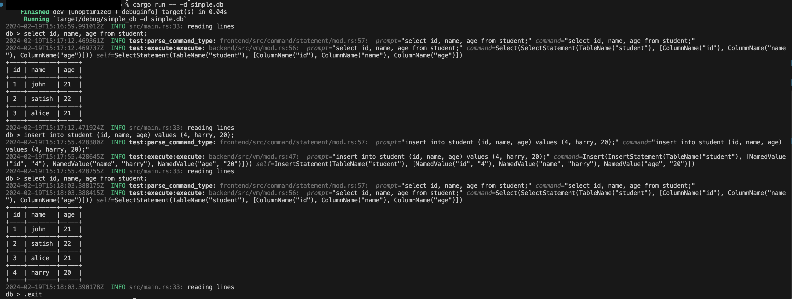

# simple_db
A basic toy db written in Rust.
This implementation takes inspiration and add lots of flexibility on top of [this](https://cstack.github.io/db_tutorial/).

### how to run
Follow [rust installation](https://doc.rust-lang.org/cargo/getting-started/installation.html) if you do not have rust installed.  
`cargo run -- -d simple.db` this will create `simple.db` directory where schema and table files are stored.  
You can choose to give different name.  
To make code execution, we are using [tokio tracing](https://tokio.rs/tokio/topics/tracing) with level `info`.

### Sample interaction

### what it can do so far
1. Parse create, insert and select commands.
2. All commands must be in lower case. It is done to simplify case sensitivity difference b/w meta data like table, column name vs actual data.
3. All select and insert command must have columns in right order aka order in table creation.
4. Table records are added to page. Current implementation uses simplified version of slop page mechanism. To simplify, slot offset are written in header. Also unlike recommended implementation, where data is written from back to front, it writes from front to back. This put constraint of fixed size slot in page (need to know where slot area end in advance.).
5. Types supported are 
    * Int - this is saved as i64.
    * Text - this is saved as string.